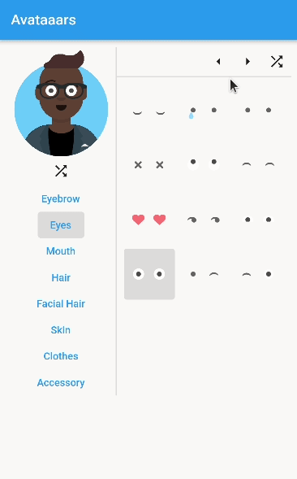
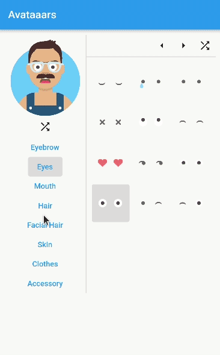

# Avataaars
Avataaars is a Flutter package that provides Avataaar classes which enable an easy svg generation of beautiful personal avatars.  
This package is heavily inspired by [Avataaars Generator](https://github.com/fangpenlin/avataaars-generator).  
The original avatars were designed by [Pablo Stanley](https://twitter.com/pablostanley), the Sketch library can be found [here](https://www.avataaars.com/).

## Presentation

The following Avataaar customizer is not part of this package, but can be found in the example folder.  
It should nevertheless showcase the functionality of the Avataaar classes.
 

  

## Usage
- Create a random Avataaar with `Avataaar.random()`
- Edit the individual parts, by making use of the `copyWith` method.
- Get the SVG String by calling `Avataaar.toSvg()`

## Known Errors
By using the [flutter_svg](https://pub.dev/packages/flutter_svg) package to render the svg strings, it can happen that a warning appears in the console.  
This warning is most likely along the lines: "unhandled element filter;".   It is related to this [issue](https://github.com/dnfield/flutter_svg/issues/533).